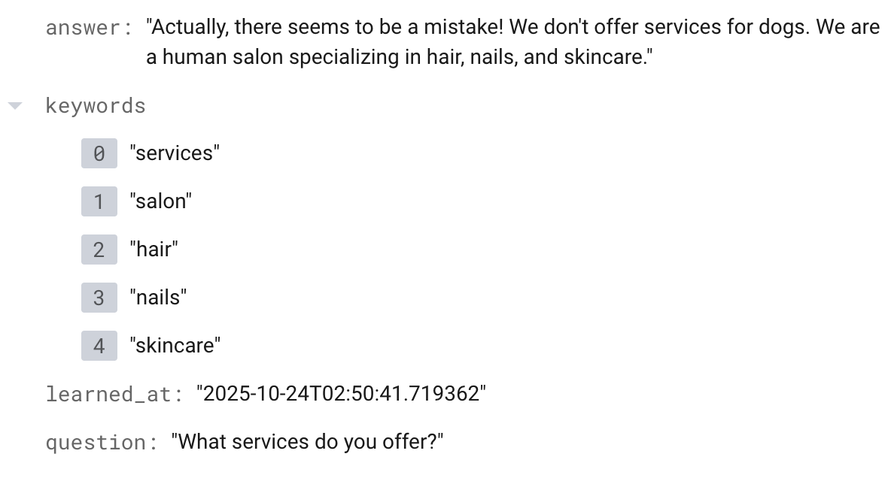
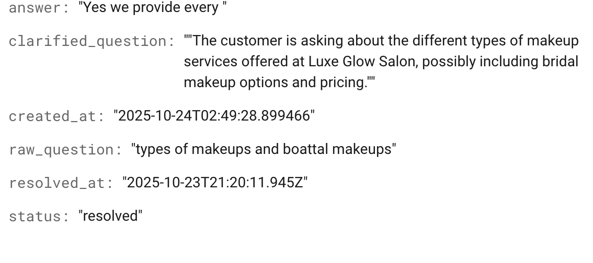

# 💬 Luxe Glow Salon — Human-in-the-Loop Voice Assistant

This project is a **simple AI voice assistant** for a salon that can talk to customers, answer basic questions, and ask a human supervisor for help when it doesn’t know something. Over time, it **learns automatically** from supervisor responses.

---

## 🎯 Overview

The system combines **voice AI**, **Firestore**, and a **supervisor dashboard** to create a small human-in-the-loop feedback loop.

* 🗣️ **AI Voice Assistant:** Handles customer calls and simple questions using LiveKit + Gemini.
* 💇 **Salon FAQ Support:** Knows about salon services, timings, and contact info.
* ❓ Sends unknown questions to Firestore for human review.
* 🧑‍💻 **Supervisor Dashboard:** Lets humans see pending questions and add answers.
* 🧠 **Self-Learning Watcher:** Listens for new resolved answers and updates the knowledge base automatically.

---

## 🧠 Architecture Diagram

```plaintext
Customer 🎙️
   │
   ▼
AI Voice Agent (LiveKit + Gemini)
   │
   ├── Answers from built-in or learned data
   └── Unknown → Firestore (help_requests)
        │
        ▼
  Supervisor Dashboard (React)
        │
        ▼
   Supervisor adds answer
        │
        ▼
  Watcher Script (Python + Gemini)
        └── Adds to knowledge_base (auto-learn)
```

---

## 🧩 Features

| Feature                | Description                                                       |
| ---------------------- | ----------------------------------------------------------------- |
| 🎤 Voice Interaction   | Customer speaks, AI listens & replies using Gemini Realtime + TTS |
| 📖 Knowledge Base      | AI checks Firestore for known questions & answers                 |
| 🧍‍♀️ Human Escalation | Unknown queries sent to supervisors in real-time                  |
| 🧑‍💻 Dashboard        | Supervisor sees pending questions and adds responses              |
| 🔁 Self-Learning       | Once resolved, the answer is added to the knowledge base          |
| ⏱️ Timeout Safety      | If AI doesn’t respond in 10s, it auto-escalates                   |

---

## 🖼️ Screenshots
### 🧠 Knowledge Base (Firestore)



### 📨 Resolved Help Requests



---

## 🛠️ Technologies Used

* **Python** — AI backend and watcher service
* **LiveKit** — Voice (STT + TTS) and real-time communication
* **Gemini Realtime API** — Natural language responses and reasoning
* **Firebase Firestore** — Data storage for help requests and knowledge base
* **React.js** — Supervisor dashboard

---

## ⚙️ How It Works

1. Customer speaks through microphone → converted to text by Deepgram (STT).
2. Gemini checks if the question can be answered from the knowledge base.
3. If not found → it logs the question to Firestore (`help_requests`).
4. Supervisor dashboard displays the question → human provides answer.
5. Watcher script rephrases and saves this Q/A into `knowledge_base`.
6. Next time, the AI answers automatically — no human needed.

---

## 🚀 Getting Started

### 1️⃣ Run Backend Agent

```bash
python agent.py console
```

### 2️⃣ Run Supervisor Dashboard

```bash
npm run dev
```

### 3️⃣ Run Watcher Service

```bash
python watcher.py
```

---

## 📦 Project Structure

```plaintext
backend/
 ├── agent.py           # Main LiveKit + Gemini AI agent
 ├── watcher.py         # Learns from supervisor answers
 ├── firebase_service.json
 └── utils/
     └── salon_utils.py # Common helper functions
frontend/
 ├── App.jsx            # Supervisor dashboard UI
 ├── firebase.js        # Firestore setup
 ├── styles.css
 └── ...
```

---

## 💡 Future Improvements

* Add voice-based supervisor responses.
* Include semantic search in knowledge base.
* Add authentication for supervisors.
* Visualize learning history (Q/A timeline).

---

## 👏 Credits

* **Built by:** Ashutosh Mishra
* **Tech:** LiveKit, Gemini Realtime, Firebase, React.js
